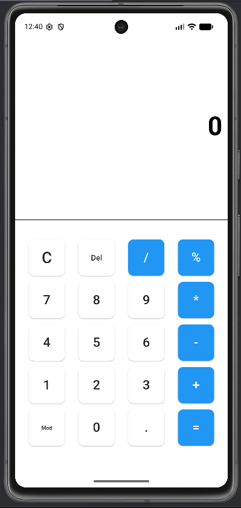
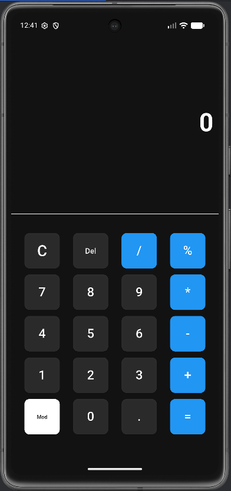
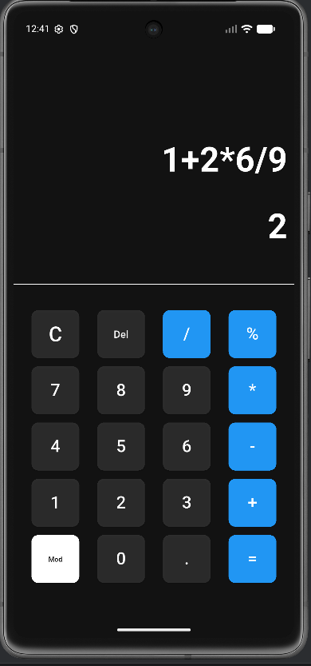

# 🧮 Calculator App

A simple Flutter calculator app built using Dart.

## ✨ Features
- ➕ Addition
- ➖ Subtraction
- ✖️ Multiplication
- ➗ Division
- 🎨 Clean UI
- 🌗 Dark & Light Theme Toggle

## 📸 Screenshot

## 🚀 Tech Used
- Flutter
- Dart

## 👨‍💻 Author
Kumaran

